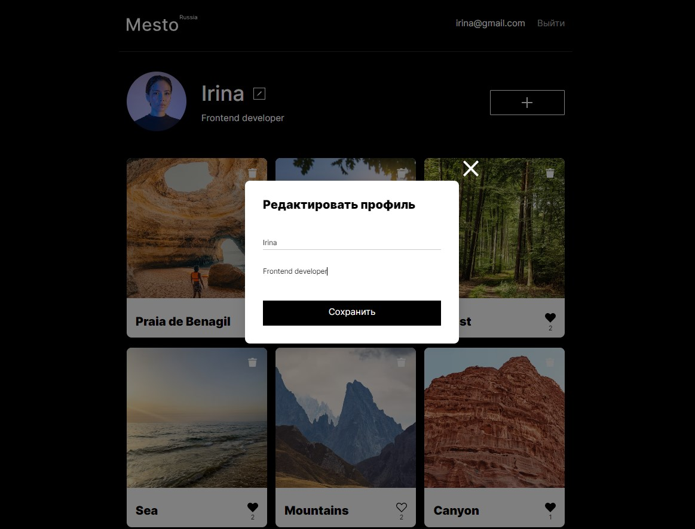
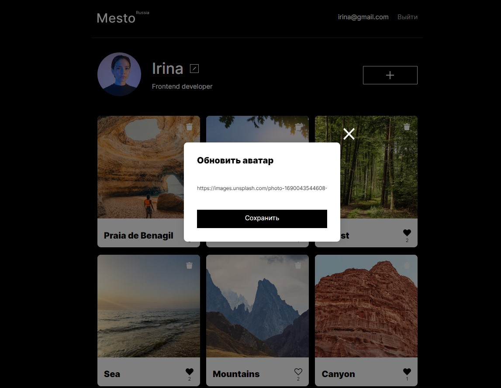
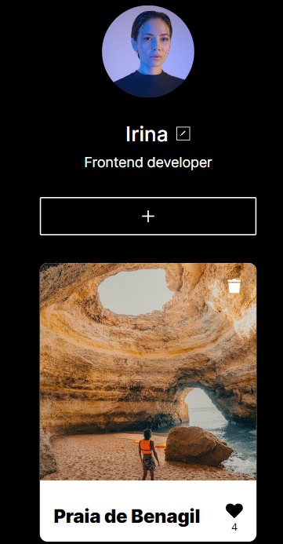

# Educational project: Setting Up and Deploying the 'Mesto' Project from [Yandex Practicum](https://practicum.yandex.ru/) Web-developer course.

## Description

Project `Mesto` is a spa where users can share photos, delete them, and like them, as well as change user information and avatar. Project includes frontend and backend components. Place the backend in the `backend/` directory and the frontend in the `frontend/` directory.

## Links

IP: 84.201.128.230  
Frontend: https://mesto.irina.nomoreparties.co/  
Backend: https://api.mesto.irina.nomoreparties.co/  

## Functionality

* User registration and authorization
* Editing user data
* Updating avatar
* Adding a new card
* Adding and removing likes (including like counter)
* Modal window with an enlarged photo of the card
* Deleting a card created by the user with a confirmation modal window
* Data exchange with the server

## Technologies
### Frontend
* HTML
* BEM
* CSS
* Flexbox
* GRID
* React JS (Functional components, hooks)
* Webpack

### Backend
* Node.js
* Express
* MongoDB
* Nginx
* pm2
* Celebrate
* Winston

## Screenshots

<b>Show all</b>

## How to install and run locally

It may happen that `Mesto` can not be available due to hosting expiration. You have ability to download and run this app\repo locally.

### Frontend

* Settings for frontend (./frontend folder). All commands are located in package.json:

Clone repository:

  `git clone git@github.com:IrinaGarmaeva/react-mesto-api-full-gha.git`

Install dependencies:

  `npm install`

Run app:

  `npm run start`

Build app(production):

  `npm run build`

## Backend

* Settings for backend (./backend folder). All commands are located in package.json:

Clone repository:

  git clone git@github.com:IrinaGarmaeva/react-mesto-api-full-gha.git

Install dependencies:

  `npm install`

Run app:

  `npm run start` - start server  
  `npm run dev` - start hot-reload server  

## Directories

  `/routes` - folder with routes files  
  `/controllers` - folder with controllers files(users&cards)  
  `/models` - folder with schemas(users&cards)  

## Figma designs:

- [Figma 4](https://www.figma.com/file/2cn9N9jSkmxD84oJik7xL7/JavaScript.-Sprint-4);
- [Figma 5](https://www.figma.com/file/bjyvbKKJN2naO0ucURl2Z0/JavaScript.-Sprint-5);
- [Figma 6-7](https://www.figma.com/file/kRVLKwYG3d1HGLvh7JFWRT/JavaScript.-Sprint-6);
- [Figma 9](https://www.figma.com/file/PSdQFRHoxXJFs2FH8IXViF/JavaScript-9-sprint);
- [Figma 12](https://www.figma.com/file/5H3gsn5lIGPwzBPby9jAOo/JavaScript.-Sprint-12).

